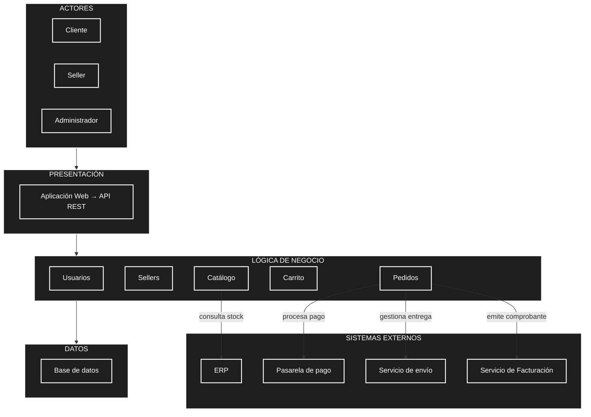

# Marketplace de productos para mascotas

## Nombre

isaias ramos lopez

## Descripción

Marketplace académico de productos para mascotas.

## Caso de estudio

GoPet como referencia funcional.

## Curso

Arquitectura de Software

## Documentación del laboratorio (GUIA 02)

La documentación se organiza siguiendo las dos etapas del laboratorio:

### Etapa 1 — Análisis del sistema

- [Actores del sistema](analisis-de-sistema/01-actores.md)
- [Historias de usuario](analisis-de-sistema/02-historias-del-usuario.md)
- [Requisitos funcionales](analisis-de-sistema/03-requisitos-funcionales.md)
- [Atributos de calidad](analisis-de-sistema/04-atributos-de-calidad.md)
- [Restricciones](analisis-de-sistema/05-restricciones.md)
- [Drivers arquitectónicos](analisis-de-sistema/06-driver-arquitectonicos.md)

### Etapa 2 — Diseño arquitectónico inicial

- [Arquitectura inicial (diagrama Mermaid)](arquitectura/arquitectura-inicial.md)
- [Código fuente del diagrama](images/arquitectura_sistema.mmd)

## Vista previa del diagrama de arquitectura

