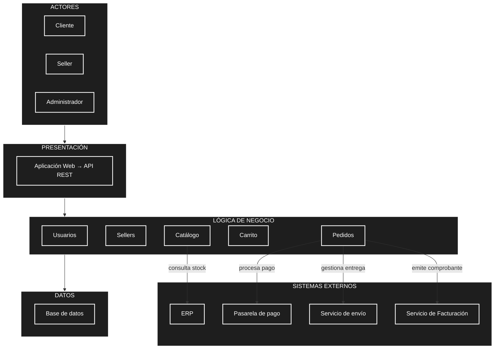

# Marketplace de productos para mascotas

## Nombre

isaias ramos lopez

## Descripción

Marketplace académico de productos para mascotas.

## Caso de estudio

GoPet como referencia funcional.

## Curso

Arquitectura de Software

## Implementación de referencia (boilerplate)

El repositorio incorpora como código de partida el **boilerplate** del curso:

- Origen: <https://github.com/devlizbethjaico/boilerplate.git>
- Aplicación Angular 18 que aplica **Clean Architecture** sobre cuatro capas: `dominio/`, `aplicacion/`, `infraestructura/` y `presentacion/`.

### Puesta en marcha del código

```bash
npm install
npm start          # aplicación en http://localhost:4200
npm run pruebas    # pruebas del dominio, sin Angular
npm run build      # compilación de producción
```

El proyecto arranca con **adaptadores en memoria**, por lo que no necesita base de datos, credenciales ni conexión a internet.

## Estructura del proyecto

```
.
├── analisis-de-sistema/     # Documentación de la Etapa 1 (docs)
├── arquitectura/            # Documentación de la Etapa 2 (docs)
├── images/                  # Recursos gráficos y diagramas Mermaid
├── src/                     # Código fuente Angular (boilerplate)
│   └── app/
│       ├── dominio/         # Reglas del negocio + contratos
│       ├── aplicacion/      # Casos de uso
│       ├── infraestructura/ # Adaptadores (memoria, HTTP, pagos, etc.)
│       └── presentacion/    # Componentes Angular
├── public/
├── angular.json
├── package.json
├── tsconfig*.json
└── README.md
```

## Documentación del laboratorio

La documentación se organiza siguiendo las dos etapas del laboratorio:

### Etapa 1 — Análisis del sistema

- [Actores del sistema](analisis-de-sistema/01-actores.md)
- [Historias de usuario](analisis-de-sistema/02-historias-del-usuario.md)
- [Requisitos funcionales](analisis-de-sistema/03-requisitos-funcionales.md)
- [Atributos de calidad](analisis-de-sistema/04-atributos-de-calidad.md)
- [Restricciones](analisis-de-sistema/05-restricciones.md)
- [Drivers arquitectónicos](analisis-de-sistema/06-driver-arquitectonicos.md)
- [Decisiones arquitectónicas (ADR)](analisis-de-sistema/07-decision-arquitectonica.md)

### Etapa 2 — Diseño arquitectónico inicial

- [Arquitectura inicial (diagrama Mermaid)](arquitectura/arquitectura-inicial.md)
- [Estilo arquitectónico](arquitectura/estilo-arquitectonico.md)
- [Código fuente del diagrama](images/arquitectura_sistema.mmd)

## Vista previa del diagrama de arquitectura


```mermaid
flowchart TD

    subgraph ACTORES["ACTORES"]
        Cliente["Cliente"]
        Seller["Seller"]
        Admin["Administrador"]
    end

    subgraph PRESENTACION["PRESENTACIÓN"]
        Web["Aplicación Web → API REST"]
    end

    subgraph NEGOCIO["LÓGICA DE NEGOCIO"]
        Usuarios["Usuarios"]
        Sellers["Sellers"]
        Catalogo["Catálogo"]
        Carrito["Carrito"]
        Pedidos["Pedidos"]
    end

    subgraph DATOS["DATOS"]
        BD["Base de datos"]
    end

    subgraph EXTERNOS["SISTEMAS EXTERNOS"]
        Pago["Pasarela de pago"]
        ERP["ERP"]
        Envio["Servicio de envío"]
        Facturacion["Servicio de Facturación"]
    end

    ACTORES --> PRESENTACION
    PRESENTACION --> NEGOCIO
    NEGOCIO --> DATOS

    Catalogo -->|"consulta stock"| ERP
    Pedidos -->|"procesa pago"| Pago
    Pedidos -->|"gestiona entrega"| Envio
    Pedidos -->|"emite comprobante"| Facturacion

    classDef darkBox fill:#1e1e1e,stroke:#ffffff,stroke-width:2px,color:#ffffff
    class ACTORES,PRESENTACION,NEGOCIO,DATOS,EXTERNOS darkBox
    class Cliente,Seller,Admin,Web,Usuarios,Sellers,Catalogo,Carrito,Pedidos,BD,Pago,ERP,Envio,Facturacion darkBox
```