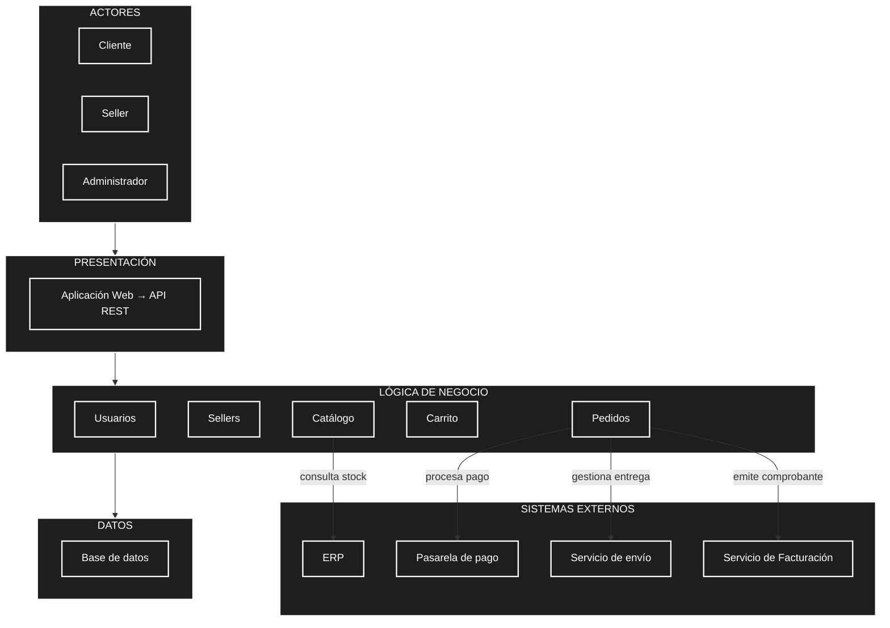

# Arquitectura inicial del sistema

## 1. Arquitectura en tres capas

A partir del análisis del sistema (actores, requisitos, atributos de calidad, restricciones y drivers arquitectónicos), se propone organizar la solución en una **arquitectura en tres capas**, la cual separa responsabilidades y facilita la mantenibilidad.

```
┌────────────────────────────────────┐
│           PRESENTACIÓN             │
│       Web / API / Interfaz         │
└─────────────────┬──────────────────┘
                  ↓
┌────────────────────────────────────┐
│         LÓGICA DE NEGOCIO          │
│                                    │
│ Catálogo                           │
│ Carrito                            │
│ Pedidos                            │
│ Sellers                            │
│ Usuarios                           │
└─────────────────┬──────────────────┘
                  ↓
┌────────────────────────────────────┐
│               DATOS                │
│           Base de datos            │
└────────────────────────────────────┘
```

| Capa | Pregunta que responde |
|------|------------------------|
| Presentación | ¿Cómo interactúa el usuario? |
| Lógica de negocio | ¿Qué hace el sistema? |
| Datos | ¿Dónde se almacena la información? |

### Responsabilidades por capa

- **Presentación:** expone la interfaz web y la API REST que será consumida desde el frontend. Encargada de la interacción con clientes, sellers y administradores.
- **Lógica de negocio:** contiene los módulos principales del marketplace: Usuarios, Sellers, Catálogo, Carrito y Pedidos. Aplica las reglas del negocio y orquesta las integraciones externas.
- **Datos:** persiste la información de usuarios, sellers, productos, carrito, pedidos y demás entidades del sistema en una base de datos.

## 2. Diagrama de arquitectura

El código fuente Mermaid también se encuentra disponible en [`/images/arquitectura_sistema.mmd`](../images/arquitectura_sistema.mmd) para poder reutilizarlo en otros documentos.



## 3. Descripción

La arquitectura inicial se organiza en tres capas principales:

- **Presentación:** permite la interacción de los usuarios con el sistema mediante la aplicación web y la API REST.
- **Lógica de negocio:** contiene los principales módulos responsables de las funcionalidades del sistema: usuarios, sellers, catálogo, carrito y pedidos.
- **Datos:** permite almacenar y consultar la información mediante una base de datos, ubicada a un costado de la capa de negocio.

Además:

- El módulo de **Catálogo** consulta el stock desde el **ERP** corporativo.
- El módulo de **Pedidos** se integra con la **pasarela de pago** para procesar el cobro, con el **servicio de envío** para gestionar la entrega y con el **servicio de facturación** para emitir el comprobante de pago.
