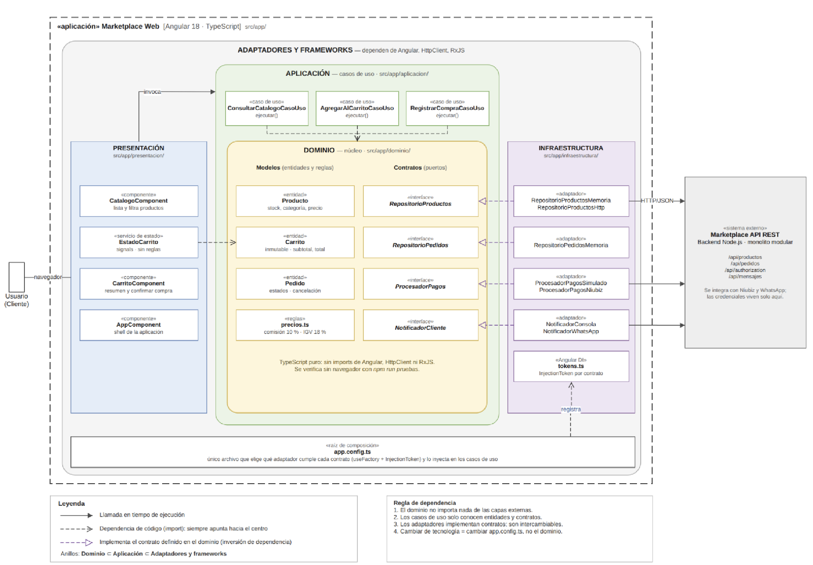

# Enfoque arquitectónico: Clean Architecture

> Define **cómo se organizan internamente** las responsabilidades y dependencias de la aplicación web Angular.



## 1. Enfoque seleccionado: **Clean Architecture (Arquitectura Limpia)**

La aplicación web se construye aplicando **Clean Architecture**, un enfoque que organiza el sistema alrededor de las **reglas de negocio** y establece que las dependencias del código deben apuntar **hacia el interior**, evitando que el núcleo del negocio dependa de Angular, `HttpClient`, `RxJS` o de cualquier servicio externo.

### Objetivo

Separar responsabilidades y controlar las dependencias hacia el dominio.

### ¿Qué problema resuelve?

Evita el acoplamiento entre la interfaz Angular, las reglas del negocio y las tecnologías externas (bases de datos, API REST, pasarela de pago, WhatsApp, etc.).

## 2. Estructura de capas

La aplicación web se divide en **cuatro capas concéntricas** dentro de `boilerplate/src/app/`:

| Capa                | Ruta                       | Responsabilidad                                                                       | Ejemplos                                                                                                                                                                 |
| ------------------- | -------------------------- | ------------------------------------------------------------------------------------- | ------------------------------------------------------------------------------------------------------------------------------------------------------------------------ |
| **Dominio**         | `src/app/dominio/`         | Núcleo. Entidades, objetos de valor y reglas de negocio. **No importa nada externo.** | `Producto`, `Carrito`, `Pedido`, `precios.ts`, contratos (`RepositorioProductos`, `ProcesadorPagos`, `NotificadorCliente`).                                              |
| **Aplicación**      | `src/app/aplicacion/`      | Casos de uso. Orquestan entidades y contratos.                                        | `ConsultarCatalogoCasoUso`, `AgregarAlCarritoCasoUso`, `RegistrarCompraCasoUso`.                                                                                         |
| **Infraestructura** | `src/app/infraestructura/` | Adaptadores que implementan los contratos. Aquí sí aparece Angular (`HttpClient`).    | `RepositorioProductosMemoria`, `RepositorioProductosHttp`, `ProcesadorPagosSimulado`, `ProcesadorPagosNiubiz`, `NotificadorConsola`, `NotificadorWhatsApp`, `tokens.ts`. |
| **Presentación**    | `src/app/presentacion/`    | Componentes y servicios de Angular. UI y estado de UI.                                | `CatalogoComponent`, `CarritoComponent`, `EstadoCarrito`, `AppComponent`.                                                                                                |

**Anillos concéntricos:** Dominio ⊂ Aplicación ⊂ Adaptadores y frameworks.

## 3. Raíz de composición

Archivo único: `boilerplate/src/app/app.config.ts`.

Es el **único archivo de toda la aplicación** donde se decide qué adaptador cumple cada contrato, mediante `useFactory` + `InjectionToken`.

```ts
// Ejemplo: alternar entre adaptador en memoria y adaptador HTTP
{ provide: REPOSITORIO_PRODUCTOS, useClass: RepositorioProductosMemoria }
// { provide: REPOSITORIO_PRODUCTOS, useClass: RepositorioProductosHttp }
```

Cambiar de proveedor se resume en descomentar/comentar líneas; ni el dominio ni los casos de uso se enteran.

## 4. Sistema externo (visto desde la app)

La aplicación Angular se comunica con el backend a través de la **API REST del monolito** documentada en [`../estilo-arquitectonico.md`](../estilo-arquitectonico.md):

| Endpoint                  | Uso                           |
| ------------------------- | ----------------------------- |
| `GET/POST /api/productos` | Catálogo y stock.             |
| `GET/POST /api/pedidos`   | Carrito, checkout y consulta. |
| `POST /api/autorizacion`  | Login y emisión de JWT.       |
| `POST /api/mensajes`      | Notificaciones.               |

## 5. Reglas del enfoque (Clean Architecture)

1. **El dominio no importa nada de las capas externas.** Ni `@angular/core`, ni `HttpClient`, ni `RxJS`.
2. **Los casos de uso solo conocen entidades y contratos.**
3. **Los adaptadores implementan contratos y son intercambiables.**
4. **Cambiar de tecnología = cambiar `app.config.ts`, no el dominio.**

Estas reglas se verifican mecánicamente con `bun run pruebas`, que compila **solo** `dominio/`, `aplicacion/` y los adaptadores en memoria. Si alguna de esas capas importara Angular, la compilación fallaría.

## 6. Beneficios

- **Mantenibilidad** (DA06): facilita cambios y reduce el impacto de una modificación.
- **Testabilidad**: las reglas del dominio se ejecutan en milisegundos sin navegador ni Angular.
- **Interoperabilidad** (DA08 / DA09): pasar de pagos simulados a Niubiz o de notificaciones por consola a WhatsApp solo requiere cambiar el adaptador.
- **Sustitución del backend**: pasar de `RepositorioProductosMemoria` a `RepositorioProductosHttp` no toca el dominio.

## 7. Leyenda del diagrama

| Símbolo                    | Significado                                                                 |
| -------------------------- | --------------------------------------------------------------------------- |
| Flecha sólida →            | Llamada en tiempo de ejecución.                                             |
| Flecha discontinua - - - > | Dependencia de código (`import`): siempre apunta hacia el centro (dominio). |
| Flecha violeta - - - ▷     | Implementa el contrato definido en el dominio (inversión de dependencia).   |

## 8. Relación con el estilo arquitectónico (PASO 4)

| Nivel                               | Documento                                                    | Pregunta que responde                                                     |
| ----------------------------------- | ------------------------------------------------------------ | ------------------------------------------------------------------------- |
| **Estilo arquitectónico** (PASO 4)  | [`../estilo-arquitectonico.md`](../estilo-arquitectonico.md) | ¿Cómo se organiza y despliega **globalmente** el sistema?                 |
| **Enfoque arquitectónico** (PASO 5) | Este documento                                               | ¿Cómo se organizan **internamente** las responsabilidades y dependencias? |
