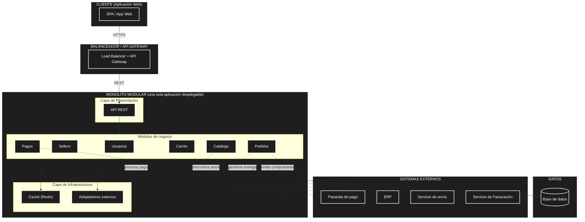

# Estilo arquitectónico del sistema

## 1. Estilo seleccionado: **Monolito modular**

El marketplace se construye como un **único artefacto desplegable**, organizado internamente en **módulos de negocio bien delimitados** (Catálogo, Carrito, Pedidos, Pagos, Usuarios). Los módulos comparten el mismo proceso y la misma base de datos, pero se mantienen **débilmente acoplados** mediante interfaces internas, lo que permite que el sistema pueda:

- Desplegarse como una sola unidad.
- Escalarse horizontalmente levantando varias réplicas detrás de un balanceador.
- Evolucionar y probar cada módulo de forma independiente dentro del mismo repositorio.

## 2. ¿Por qué monolito modular?

La selección se justifica a partir de los drivers arquitectónicos definidos en [`analisis-de-sistema/06-driver-arquitectonicos.md`](../analisis-de-sistema/06-driver-arquitectonicos.md):

| Driver                | Aporte a la decisión                                                                                                         |
| --------------------- | ---------------------------------------------------------------------------------------------------------------------------- |
| DA01 – Escalabilidad  | Un monolito se replica fácilmente detrás de un balanceador y escala horizontal cuando hay picos en campañas.                 |
| DA06 – Mantenibilidad | La división en módulos (Catálogo, Carrito, Pedidos, Pagos, Usuarios) reduce el impacto de una modificación sobre el sistema. |
| DA03 – Seguridad      | Un único perímetro de seguridad simplifica autenticación, autorización y auditoría de acceso.                                |
| DA04 – Pago externo   | La integración con la pasarela se aísla en un módulo adaptador detrás de un puerto, sin afectar al resto.                    |
| DA05 – API REST       | El monolito expone una única API REST que sirve a la aplicación web.                                                         |
| DA02 – Rendimiento    | La alta concurrencia se atiende con caché y optimización interna, sin necesidad de distribuir procesos.                      |

Un enfoque de **microservicios** se descartó por la complejidad operativa (múltiples despliegues, observabilidad distribuida y consistencia de datos entre servicios) que no se justifica en el alcance actual del marketplace.

## 3. Estructura global del sistema

## 4. Despliegue

| Aspecto            | Decisión                                                                                    |
| ------------------ | ------------------------------------------------------------------------------------------- |
| Tipo de despliegue | Aplicación única (monolito) ejecutándose en un contenedor o runtime.                        |
| Escalabilidad      | Réplicas horizontales detrás de un balanceador / API Gateway.                               |
| Persistencia       | Una única base de datos relacional (PostgreSQL).                                            |
| Caché              | Servicio de caché independiente (Redis) consumido por los módulos.                          |
| Integraciones      | Adaptadores en la capa de infraestructura hacia pasarela de pago, ERP, envío y facturación. |
| Frontend           | Aplicación web separada que consume la API REST del monolito.                               |

## 5. Relación con el enfoque arquitectónico (PASO 5)

El monolito se organiza internamente en capas (presentación, aplicación, dominio e infraestructura) según el enfoque **Clean Architecture** que se documentará en `arquitectura/enfoque/enfoque-arquitectonico.md` (PASO 5 de la guía):

- **Estilo arquitectónico (PASO 4)** → define _la forma global_ del sistema: monolito modular.
- **Enfoque arquitectónico (PASO 5)** → define _cómo se organizan_ internamente las responsabilidades y dependencias: Clean Architecture.

Ambos niveles son complementarios y responden a drivers distintos: el estilo a la escalabilidad y desplegabilidad; el enfoque a la mantenibilidad y la separación de responsabilidades.
