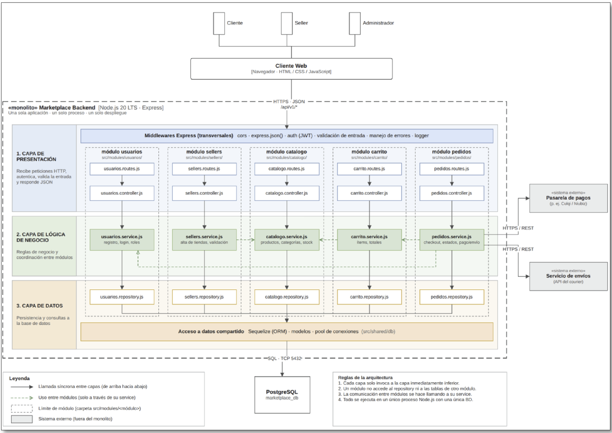

# Estilo arquitectónico del sistema

> Documento correspondiente al **PASO 4** de la GUIA-003-ASF.
> Define la **forma global** del sistema: cómo se organiza y se despliega el backend.

## 1. Estilo seleccionado: **Monolito modular por capas**

El backend del marketplace se construye como un **«monolito»** ejecutado en un **único proceso Node.js 20 LTS con Express**, organizado internamente en **tres capas** y **módulos de negocio** débilmente acoplados.

- **Una sola aplicación · un solo proceso · un solo despliegue.**
- **Una sola base de datos PostgreSQL** (`marketplace_db`).
- Una **API REST** única (prefijo `/api/v1/*`) consumida desde la aplicación web.

## 2. Módulos y capas del monolito

Cada módulo de negocio (usuarios, sellers, catálogo, carrito, pedidos) se divide en tres capas con un único archivo por rol:

| Capa                             | Responsabilidad                                                       | Archivos por módulo                             |
| -------------------------------- | --------------------------------------------------------------------- | ----------------------------------------------- |
| **1. Capa de Presentación**      | Recibe peticiones HTTP, autentica, valida la entrada y responde JSON. | `<modulo>.routes.js` · `<modulo>.controller.js` |
| **2. Capa de Lógica de Negocio** | Reglas de negocio y coordinación entre módulos.                       | `<modulo>.service.js`                           |
| **3. Capa de Datos**             | Persistencia y consultas a la base de datos.                          | `<modulo>.repository.js`                        |

Además, todos los módulos comparten:

- **Middlewares Express** transversales: `cors`, `express.json()`, `auth (JWT)`, `validación de entrada`, `manejo de errores`, `logger`.
- **Acceso a datos compartido**: Sequelize (ORM) con modelos y pool de conexiones en `src/shared/db`.

## 3. Módulos de negocio

| Módulo     | Service                         |
| ---------- | ------------------------------- |
| `usuarios` | Registro, login y roles.        |
| `sellers`  | Alta de tiendas y validación.   |
| `catalogo` | Productos, categorías y stock.  |
| `carrito`  | Ítems y totales.                |
| `pedidos`  | Checkout, estados y pago/envío. |

## 4. Sistemas externos

| Sistema externo                      | Protocolo    | Módulo que lo consume |
| ------------------------------------ | ------------ | --------------------- |
| Pasarela de pagos (Culqi / Niubiz)   | HTTPS / REST | `pedidos`             |
| Servicio de envíos (API del courier) | HTTPS / REST | `pedidos`             |

## 5. Reglas del estilo

1. **Cada capa solo invoca a la capa inmediatamente inferior.**
2. **Un módulo no accede al repository ni a las tablas de otro módulo.**
3. **La comunicación entre módulos se hace llamando a su service**, no a su repository.
4. **Todo se ejecuta en un único proceso Node.js con una única base de datos.**

## 6. ¿Por qué monolito modular?

La selección se justifica a partir de los drivers arquitectónicos definidos en [`analisis-de-sistema/06-driver-arquitectonicos.md`](../analisis-de-sistema/06-driver-arquitectonicos.md):

| Driver                | Aporte a la decisión                                                                                                           |
| --------------------- | ------------------------------------------------------------------------------------------------------------------------------ |
| DA01 – Escalabilidad  | Un monolito se replica fácilmente detrás de un balanceador y escala horizontal cuando hay picos en campañas.                   |
| DA06 – Mantenibilidad | La división en módulos (usuarios, sellers, catálogo, carrito, pedidos) reduce el impacto de una modificación sobre el sistema. |
| DA03 – Seguridad      | Un único perímetro de seguridad simplifica autenticación (JWT), autorización y auditoría de acceso.                            |
| DA04 – Pago externo   | La integración con la pasarela se aísla en el `pedidos.service.js` mediante un adaptador HTTP.                                 |
| DA05 – API REST       | El monolito expone una única API REST que sirve a la aplicación web Angular.                                                   |
| DA02 – Rendimiento    | La alta concurrencia se atiende con caché y optimización interna, sin necesidad de distribuir procesos.                        |

Un enfoque de **microservicios** se descartó por la complejidad operativa (múltiples despliegues, observabilidad distribuida y consistencia de datos entre servicios) que no se justifica en el alcance actual del marketplace.

## 7. Leyenda del diagrama

| Símbolo                          | Significado                                           |
| -------------------------------- | ----------------------------------------------------- |
| Flecha sólida →                  | Llamada síncrona entre capas (de arriba hacia abajo). |
| Flecha discontinua verde - - - > | Uso entre módulos (solo a través de su service).      |
| Recuadro discontinuo             | Límite de módulo (carpeta `src/modules/<módulo>`).    |
| Caja gris                        | Sistema externo (fuera del monolito).                 |

## 8. Relación con el enfoque arquitectónico (PASO 5)

El monolito define _la forma global_ del backend. La forma en que se organiza **internamente** cada aplicación (en este caso, la **aplicación web Angular**) se describe en [`enfoque/enfoque-arquitectonico.md`](./enfoque/enfoque-arquitectonico.md):

- **Estilo arquitectónico (PASO 4)** → monolito modular por capas (backend Node.js + Express).
- **Enfoque arquitectónico (PASO 5)** → Clean Architecture aplicado en la aplicación web Angular, descrito en [`enfoque/enfoque-arquitectonico.md`](./enfoque/enfoque-arquitectonico.md).

Ambos niveles son complementarios: el estilo responde a drivers de escalabilidad y desplegabilidad; el enfoque responde a drivers de mantenibilidad y separación de responsabilidades.
